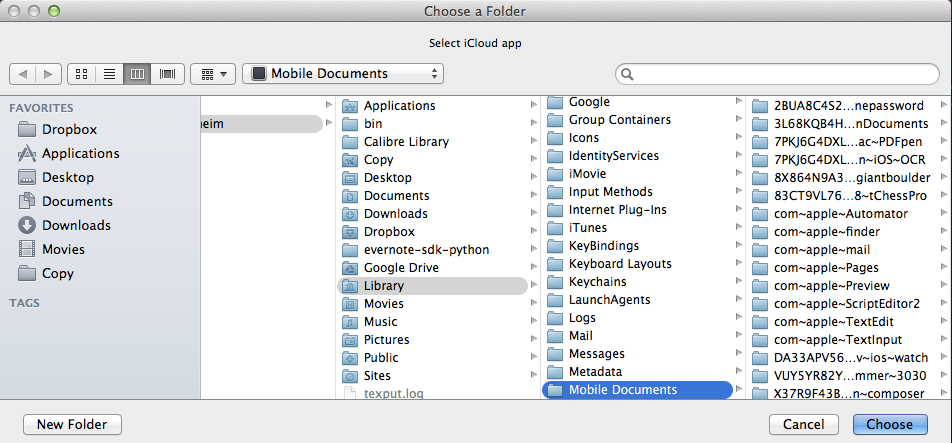

#SEND
To download, visit the [Packal page](http://www.packal.org/workflow/send)
 
###Version: 1.1
 
This workflow allows users to quickly and easily send documents to the cloud service of their choice. Once configured (`send:config`), users can make use of either:

* hotkey
* file action
* keyword

to either send a duplicate of the file to the cloud service (leaving the original where it is), or move the original itself to the cloud service.
 
##Configuration
When you run `send:config`, 3 options appear:

 
This will determine which cloud service you send your data to using the workflow. At any point, you can change your settings, but once set the workflow will *always* send the chosen file to this folder. Anyways, if you choose the `Other` option, you will need to name the service used:
 

 
After this (or if you choose iCloud or Dropbox), you will need to choose the folder you will be sending to. The workflow will begin by telling you what you need to do:
 

 
After this reminder, you will choose the folder:
 

 
This is an example of having chosen `iCloud`, and the workflow will automatically take you to the `Mobile Documents` folder in your Library, where you will see all of your iCloud enabled apps have their own personal folders. Choose the one you'd like to send your stuff to. For example, if you use [Readdle's Documents app](http://readdle.com/) on your iPad or iPhone, find that folder within the Mobile Documents folder and select it.
 
Once configured, you can send documents in a few different ways. First, you can use Alfred's `File Browser` to either send a duplicate or send the original to the cloud service you chose above:
 

 
Or you could use the keywords. `send:d` sends a duplicate of the frontmost document (if possible):
 

 
`send:o` sends the original of the frontmost file to the cloud folder (if possible):
 

 
Of course, you can also set up Hotkeys for both of these actions as well. 
 
The workflow is 90% Applescript, so it should work on all machines out-of-the-box. There is a little bit of Python, which uses [deanishe](http://www.alfredforum.com/user/5235-deanishe/)'s [Alfred-Workflow](https://github.com/deanishe/alfred-workflow) library as its backbone. 
 
Hope this is helpful, 
stephen